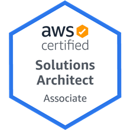

Developer.

Currently: Deciding on the next challenge.

Working for [DevicePilot](https://www.devicepilot.com)

### Talks

Recent talks:
 * Building a serverless database
 * Metaprogramming in lambda
 
### Events

Upcomming:
 * Nothing planned.
 
Previous:
 * [Hacktoberfest](https://hacktoberfest.digitalocean.com) with PRs to the [Serverless Framework](https://github.com/serverless/serverless/pulls?utf8=%E2%9C%93&q=is%3Apr+author%3Athomasmichaelwallace) and [Ramda-Adjuct](https://github.com/char0n/ramda-adjunct/pulls?utf8=%E2%9C%93&q=is%3Apr+author%3Athomasmichaelwallace)

### Certifications

